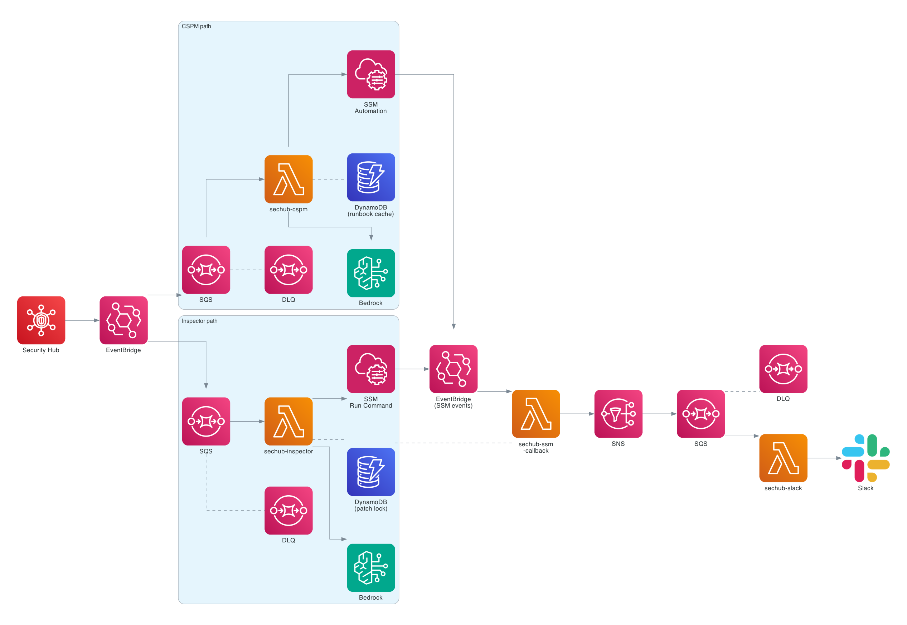

# sechub-auto-remediation

Auto-fixes AWS Security Hub findings using Bedrock to pick the right remediation. No static mapping needed. New controls and CVEs are handled without code changes.



## Lambdas

| Name | Purpose |
|---|---|
| `sechub-cspm` | Asks Bedrock which SSM runbook to run, then runs it |
| `sechub-inspector` | Asks Bedrock for the right patch command, runs it via SSM |
| `sechub-ssm-callback` | Picks up SSM completion events, resolves findings, sends to SNS |
| `sechub-slack` | Forwards SNS messages to Slack |

## Getting started

```bash
cd terraform/lambda_src
npm install
npm run build
cd ..
terraform init
terraform apply
```

Slack is optional. To enable it, add to `terraform.tfvars`:

```hcl
slack_bot_token  = "xoxb-..."
slack_channel_id = "C..."
```

## Variables

| Name | Default | What it does |
|---|---|---|
| `account_id` | — | AWS account ID to deploy into |
| `aws_region` | `us-east-1` | Where to deploy |
| `enabled_controls` | `["*"]` | Which CSPM controls to remediate (`["*"]` = all) |
| `bedrock_model_id` | Opus 4.5 | Which Bedrock model to use |
| `slack_bot_token` | `""` | Slack bot token (empty = no Slack) |
| `slack_channel_id` | `""` | Slack channel ID |
| `log_retention_days` | `30` | CloudWatch log retention |
| `lambda_timeout` | `300` | Lambda timeout in seconds |
